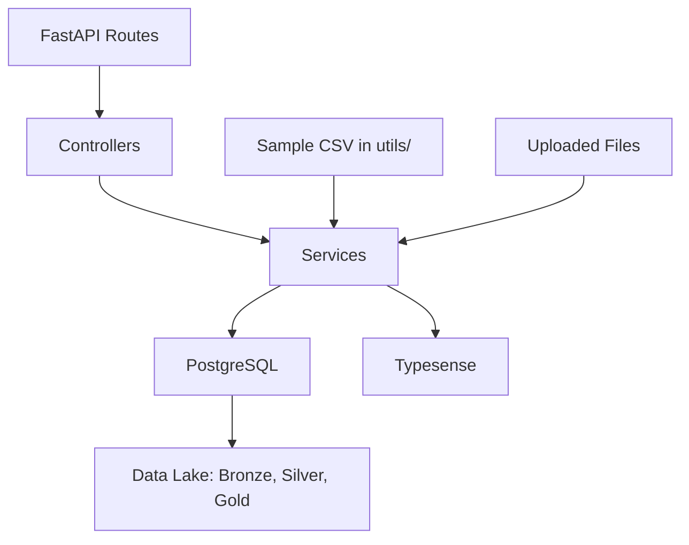

# Data Pipeline for Business Analytics

A data engineering project that implements an ETL pipeline, data lake, data warehouse, vector database, and REST API for movies business analysis.

## Architecture
- **PostgreSQL**: Data warehouse designed with a star schema for efficient querying and analytics.
- **Typesense**: Vector database enabling fast, scalable search capabilities.
- **FastAPI**: REST API for seamless data operations and interaction with the pipeline.
- **Data Lake**: Medallion architecture (bronze, silver, gold layers) using Parquet files for structured data storage and processing.

  ## Architecture Overview

This diagram illustrates the high-level flow of data through the movie data pipeline:


## Dataset

This project uses the "IMDB movies dataset" from Kaggle, available at: https://www.kaggle.com/datasets/ashpalsingh1525/imdb-movies-dataset

## Project Structure

This project is a movie data pipeline built with FastAPI, PostgreSQL, and Typesense. Click below to view the directory structure:

<summary>View Directory Structure</summary>

```plaintext
src/
├── movies_data_pipeline/           # Main app directory
│   ├── api/                        # FastAPI API layer
│   │   ├── routes/                 # API endpoints
│   │   │   ├── data.py             # POST /v0.1.0/data/seed, POST /v0.1.0/data/seed-from-file, POST /v0.1.0/data/seed-from-csv
│   │   │   ├── query.py            # GET /v0.1.0/query/movies
│   │   │   └── search.py           # GET /v0.1.0/search/movies
│   │   └── main.py                 # FastAPI entry point
│   ├── controllers/                # Business logic
│   │   ├── seed_controller.py      # Seeding logic
│   │   ├── query_controller.py     # Querying logic
│   │   └── search_controller.py    # Search logic
│   ├── services/                   # Data processing services
│   │   ├── etl_service.py          # ETL pipeline
│   │   ├── query_service.py        # Query service
│   │   ├── search_service.py       # Search service
│   │   └── seed_service.py         # Seed service
│   ├── data_access/                # Data layer
│   │   ├── models/                 # DB models
│   │   │   ├── fact_movie_performance.py  # Movie performance
│   │   │   ├── dim_movie.py        # Movie details
│   │   │   ├── dim_genre.py        # Genres
│   │   │   ├── dim_crew.py         # Crew members
│   │   │   ├── dim_country.py      # Countries
│   │   │   ├── dim_language.py     # Languages
│   │   │   ├── dim_date.py         # Dates
│   │   │   ├── bridge_movie_genre.py      # Movie-genre links
│   │   │   └── bridge_movie_crew.py       # Movie-crew links
│   │   ├── data_lake/              # Data lake
│   │   │   ├── bronze/             # Raw data
│   │   │   ├── silver/             # Cleaned data
│   │   │   └── gold/               # Optimized data
│   │   ├── database.py             # PostgreSQL connection
│   │   └── vector_db.py            # Typesense connection
│   └── domain/                     # Domain logic
│       └── models/                 # Domain models
│           └── movie.py            # Movie entity
├── Dockerfile                      # FastAPI Dockerfile
├── docker-compose.yml              # Docker Compose setup
├── pyproject.toml                  # Poetry dependencies
└── README.md                       # Documentation
```
### Overview of Key Components
| Directory         | Purpose                              |
|-------------------|--------------------------------------|
| `api/`            | FastAPI routes for seeding, querying, and searching. |
| `controllers/`    | Logic for API endpoints.             |
| `services/`       | ETL pipeline, query, and search services. |
| `data_access/`    | DB models, data lake, and connections. |
| `domain/`         | Core movie entity definition.        |
| `utils/`          | Sample CSV file for seeding.        |

## Initial Commit (v0.1.0)
The first commit includes a minimal setup for the core components of the pipeline:
- **Data Warehouse**: A star schema with `FactMoviePerformance`, `DimMovie`, `DimGenre`, `DimCrew`, `DimRole`, `DimCountry`, `DimLanguage`, `DimDate`, `BridgeMovieGenre`, and `BridgeMovieCrew`.
- **ETL Pipeline**: Loads sample movie data into the data warehouse, using a medallion architecture (bronze, silver, gold layers).
- **REST API**: Endpoints for querying, searching, and seeding data:
  - **GET `/v0.1.0/query/movies`**: Fetch movies from the PostgreSQL data warehouse. Optionally filter by `country`, `language`, `min_score`, `start_date`, and `end_date` (YYYY-MM-DD format). Supports pagination with `limit` (default: 10) and `offset` (default: 0).
  - **GET `/v0.1.0/search/movies`**: Search movies using Typesense. Query with a search term to match against `name`, `overview`, `genres`, `country`, `language`, or `status`. Supports pagination with `limit` (default: 10) and `offset` (default: 0).
  - **POST `/v0.1.0/data/seed`**: Seed sample data into PostgreSQL and Typesense. No parameters required.
- **Docker Setup**: Runs PostgreSQL, Typesense, and the FastAPI app.

## Recent Updates
This update enhances the pipeline's functionality with new features and improvements:
- **New Endpoints**:
  - **POST `/v0.1.0/data/seed-from-file`**: Seed movie data from an uploaded file (JSON, CSV, or PDF) into PostgreSQL and Typesense. Requires a file upload and a `file_type` parameter (`json`, `csv`, or `pdf`). (in progress)
  - **POST `/v0.1.0/data/seed-from-csv`**: Seed movie data from a predefined CSV file (`utils/sample_movies.csv`) into PostgreSQL and Typesense. No parameters required.
- **File Seeding**:
  - Added support for seeding data from files (JSON, CSV, PDF) via the `/v0.1.0/data/seed-from-file` endpoint.
  - Added a `utils/` directory with a `sample_movies.csv` file for seeding via the `/v0.1.0/data/seed-from-csv` endpoint.
- **Duplicate Handling**: The ETL pipeline now skips movies that already exist in the `DimMovie` table (based on the `name` column) to avoid `UniqueViolation` errors.
- **Performance Improvements**: Reduced logging verbosity for `sqlalchemy.engine` to improve performance during data loading.
- **Consistency**: Ensured that only movies successfully inserted into PostgreSQL are indexed in Typesense, maintaining consistency between the data warehouse and the vector database.
